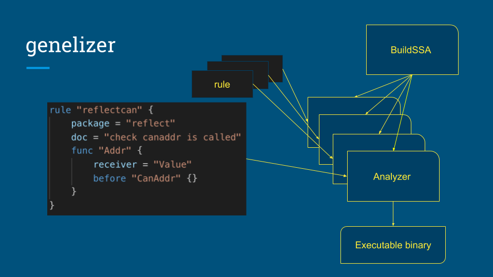

[![GitHub Actions][github-actions-badge]][github-actions]
[![CircleCI][circleci-badge]][circleci]
[![codecov][codecov-badge]][codecov]
[![GolangCI][golangci-badge]][golangci]
[![LICENSE][license-badge]][license]
[![Go Report Card][go-report-card-badge]][go-report-card]

This repository was a part of achievement in Internship in [Merpay](https://merpay.com) Expert Team.

## Quick Start

```
$ git clone https://github.com/Matts966/genelizer.git && cd genelizer
```

Now you can edit `./config/sample.hcl` or add other files in `./config` directory to change analysis and

```
$ YOUR_BINARY_NAME=binary-name make
```

Then you can get your portable binary named `binary-name`!

Or install it in your path by

```
$ YOUR_BINARY_NAME=binary-name make install
```

Also Dockerfile is located for test use.

```
$ make docker
```

## Samples

You can read some some sample config [files](https://github.com/Matts966/genelizer/tree/master/config), and corresponding [test files](https://github.com/Matts966/genelizer/tree/master/generator/testdata/src)

For example, we can ensure closing files by the setting below.

```hcl
rule "file" {
    package = "os"
    doc = "check if file is closed"
    type "*File" {
        should = [ "Close" ]
    }
}
```

Also the generated linter can be tested by the test codes below.

```go
func test10() {
	f, _ := os.Open("") // OK
	f.Close()
}

func test11() {
	_, _ = os.Open("") // want `should call Close when using \*os.File`
}
```


## Analyzer and Goroutine

The `golang.org/x/tools/go/analysis` package runs `analysis.Analyzer` concurrently per packages using goroutine and waitgroup.
See the code doing it [here](https://github.com/golang/tools/blob/be0da057c5e3c2df569a2c25cd280149b7d7e7d0/go/analysis/internal/checker/checker.go#L201).

For utilizing this feature of `golang.org/x/tools/go/analysis` , `genelizer` generates `analysis.Analyzer` for each rule in the config.

[github-actions]: https://github.com/Matts966/genelizer/actions
[github-actions-badge]: https://github.com/Matts966/genelizer/workflows/Go/badge.svg
[circleci]: https://circleci.com/gh/Matts966/genelizer
[circleci-badge]: https://circleci.com/gh/Matts966/genelizer.svg?style=svg
[codecov]: https://codecov.io/gh/Matts966/genelizer
[codecov-badge]: https://codecov.io/gh/Matts966/genelizer/branch/master/graph/badge.svg
[golangci]: https://golangci.com/r/github.com/Matts966/genelizer
[golangci-badge]: https://golangci.com/badges/github.com/Matts966/genelizer.svg
[license-badge]: https://img.shields.io/badge/License-MIT-yellow.svg
[license]: https://opensource.org/licenses/MIT
[go-report-card]: https://goreportcard.com/report/github.com/Matts966/genelizer
[go-report-card-badge]: https://goreportcard.com/badge/github.com/Matts966/genelizer
